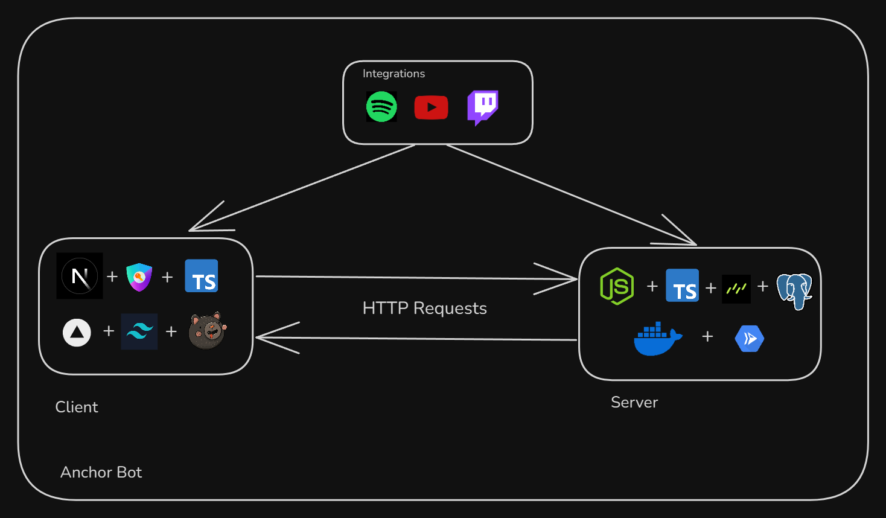

# Anchor Bot

### Index

- [Architecture](#architecture)
- [Tech stack](#tech-stack)
- [Setting up locally](#setting-up-locally)

### Architecture



### Tech Stack

- Typescript
- Next.js
- Zustand
- NextAuth
- Node.js
- PostgreSQL
- DrizzleORM
- Docker

### Setting up locally

- Setup environment variables as described in [client/.env.example](client/.env.example) and [server/.env.example](server/.env.example)

- Using script
  ```
  ./start.sh
  ```
- Using Docker
  ```
  docker compose up
  ```
- Manually through npm
  - Single terminal
    ```
      cd client && npm run dev & cd server && npm run dev &
      wait
    ```
  - Seperate terminals
    - Run client
      ```
      cd client && npm run dev
      ```
    - Run server
      ```
      cd server && npm run dev
      ```
