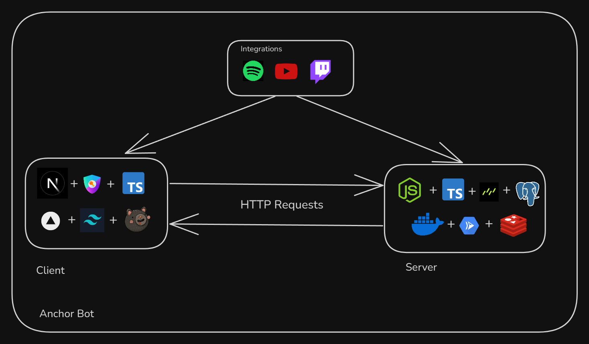

#  Anchor Bot

> A real-time Twitch bot that lets stream viewers request songs via chat — with support for YouTube and Spotify, a live queue, and customizable chat commands. Designed for streamers to automate music interaction and maintain control over their stream’s vibe.

## Overview

Anchor Bot is a full-stack application that connects to Twitch chat, interprets song commands from viewers, and manages a real-time playback queue. It’s split into a TypeScript-powered Next.js frontend and a Node.js backend, with PostgreSQL for storage and Redis for caching and rate limiting.

## Tech Stack

- **Frontend**: Next.js, Zustand, NextAuth
- **Backend**: Node.js, Express, DrizzleORM
- **Database**: PostgreSQL
- **Rate Limiting**: Redis
- **Auth**: NextAuth (OAuth with Twitch) + Spotify
- **Infra**
  - Frontend
    - Vercel
  - Backend
    - GCP Cloud Run
    - Docker
- **Languages**: TypeScript

## Architecture



- Twitch chat messages are parsed by the backend using `tmi.js`.
- Commands are validated, rate-limited via Redis, and routed to queue handlers.
- The frontend provides real-time updates of the queue, user access management, and UI for adding/removing commands.
- Songs are fetched using YouTube and Spotify APIs and synced to a single playback queue.

## Features

- **Custom Twitch Commands**  
  Create and manage your own commands directly from the frontend UI.

- **Real-time Media Requests**

  - Supports **YouTube** and **Spotify**
    - Accepts links from Twitch chat
    - Accepts language based search

- **Role-Based Access Control**  
  Limit command usage to subs, mods, followers or VIPs.

- **Responsive Frontend Dashboard**  
  Monitor queue, playback state, and manage song flow live.

## Local Setup

Set up environment variables as described in:

- [`client/.env.example`](client/.env.example)
- [`server/.env.example`](server/.env.example)

#### Use the provided script (recommended)

```bash
./start.sh
```

## Start with Docker

```bash
docker compose up --build
```

### Start manually (with npm)

```bash
cd client && npm run dev & cd server && npm run dev &
wait
```
